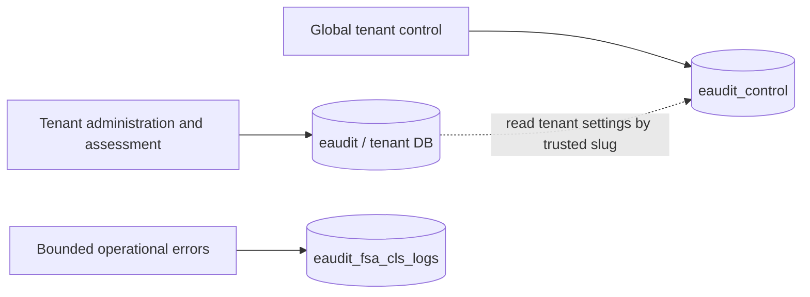

# ADR: Tenant administrators belong to the tenant data-plane

## Status

Accepted — 2026-08-17.

## Context

The platform has three independent PostgreSQL ownership planes:

Tenant `admin`/`tenant_admin` identities were previously made authoritative in
`eaudit_control`, while `question_bank.uploaded_by` and `batches.created_by` are
tenant-data ownership relationships. PostgreSQL cannot enforce those relationships
across databases, causing CSV imports to fail with `question_bank_uploaded_by_fkey`.

## Decision

- `eaudit_control` owns global `superadmin`, tenant settings, provisioning state and
  global tenant audit events.
- Each tenant `eaudit` database owns its `tenant_admin`/`admin` credentials, students,
  assessment entities and ownership foreign keys.
- Tenant login, session reload, password changes and `/api/admin/users` use the current
  tenant data-plane. Superadmin equivalents use the control-plane.
- Middleware reads tenant identity from data-plane and tenant status/capabilities from
  control-plane separately; no SQL joins connections.
- Startup copies legacy control-plane tenant accounts once with IDs and password hashes
  preserved, resets the tenant sequence, rejects ID/username conflicts and orphan
  ownership IDs, then installs local ownership foreign keys.
- Legacy/bootstrap tenant rows in control are migration input only and never runtime
  tenant-auth authority.

## Alternatives considered

- Remove ownership foreign keys and retain control-plane tenant identities: simpler
  migration, but loses database integrity and contradicts tenant data ownership.
- Duplicate live tenant identities in both databases: enables local FKs but creates two
  password/revocation authorities and repeats the original silent-delete failure.
- Remote cross-database identity checks: PostgreSQL has no native cross-database FK and
  runtime coupling would make tenant availability depend on distributed joins.

## Consequences and failure handling

- Positive: ownership FKs remain enforceable; tenant user revocation and login use one
  authority; tenant backups contain the identities needed to interpret ownership.
- Cost: middleware performs a separate control lookup for tenant status/capabilities.
- Migration is deliberately fail-closed. Conflicting IDs/usernames or orphan ownership
  stop startup without rewriting ownership, allowing an operator to reconcile safely.
- A data-plane marker prevents stale control hashes from overwriting passwords changed
  after migration.
