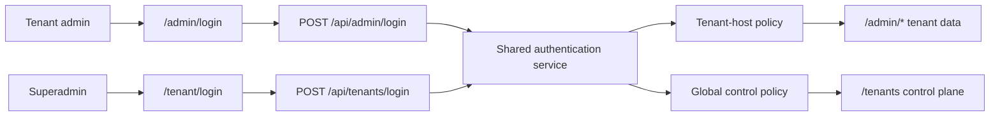

# Feature: Split tenant-admin and tenant-control authentication

## Context

The application previously exposed one shared admin login at `/admin` and one
backend endpoint at `/api/admin/login`. That endpoint accepted both tenant
administrators and the global superadmin, so the frontend route—not the backend
authentication boundary—decided which control plane the user entered.

## Requirements

- While a tenant `admin` or `tenant_admin` signs in, when credentials are
  submitted at `/admin/login`, the system shall authenticate through
  `POST /api/admin/login` and shall issue a session only when the account belongs
  to the tenant served by the current application host.
- While a superadmin signs in, when credentials are submitted at
  `/tenant/login`, the system shall authenticate through
  `POST /api/tenants/login` and shall issue a global session with no tenant
  identity.
- If a valid account is submitted to the wrong login endpoint, the system shall
  deny the request without issuing a JWT and shall direct the operator to the
  correct login surface.
- If a tenant account is unassigned, suspended, or belongs to another tenant,
  the tenant-admin endpoint shall deny the request without issuing a JWT.
- When an unauthenticated protected route redirects, tenant data routes shall
  redirect to `/admin/login` and global control routes shall redirect to
  `/tenant/login`.
- The legacy frontend `/admin` route shall redirect to `/admin/login`; it shall
  no longer host a shared-role login form.
- Authentication, password changes, and tenant-control API calls shall be
  separated into maintainable backend and frontend modules without duplicating
  credential validation or JWT creation.

## Architecture

### Backend

- `services/adminAuthentication.ts` owns input validation, credential checking,
  role/tenant scope policy, JWT creation, and password changes.
- `routes/adminAuth.ts` exposes tenant-admin authentication and protects tenant
  password changes with `requireTenantDataAdmin`.
- `routes/tenantAuth.ts` exposes superadmin authentication and protects global
  password changes with `requireSuperAdmin`.
- Existing assessment and tenant-control routers remain protected resource
  routers; they no longer contain public authentication code.

### Frontend

- `AdminLogin` invokes only the tenant-admin login action.
- `TenantLogin` invokes only the superadmin control-plane login action.
- `RoleLoginForm` contains shared presentation/form behavior without deciding
  role policy.
- `tenantControlApi` owns `/api/tenants` authentication and management calls;
  `adminApi` owns `/api/admin` tenant operations.
- `PrivateRoute` and the API 401 handler preserve the login boundary when a
  session is missing or expires.

## Security decisions

- Role scope is checked only after a password has been validated, preserving the
  generic invalid-credential response for unknown usernames and bad passwords.
- Backend policy is authoritative. Links, redirects, and hidden frontend controls
  are navigation aids only.
- Both login endpoints retain the existing ten-attempts-per-minute limiter.
- JWTs remain HS256, expire after 24 hours, and carry the same account and tenant
  claims used by request-time database revalidation.
- No database schema or password hash migration is required.

## ADR: Separate authentication surfaces by ownership plane

- **Status:** Accepted
- **Decision:** Use two explicit login endpoints and frontend routes backed by
  one shared authentication service with a required scope argument.
- **Alternatives:** A shared endpoint with frontend role redirection was rejected
  because it does not enforce the product boundary server-side. Two fully
  duplicated login implementations were rejected because validation and JWT
  behavior would drift.
- **Consequences:** Route ownership is obvious and independently testable. New
  authentication behavior must update the shared service and both relevant API
  clients where applicable.

## Acceptance criteria

- [x] `/admin/login` accepts matching `admin` and `tenant_admin` accounts only.
- [x] `/tenant/login` accepts `superadmin` accounts only.
- [x] Valid credentials submitted to the wrong endpoint return 403 and no token.
- [x] Cross-tenant, unassigned, and suspended tenant accounts remain blocked.
- [x] `/admin` redirects to `/admin/login` and protected-route redirects preserve
      the correct ownership plane.
- [x] Tenant management uses a separate frontend API module.
- [x] Backend policy tests, both TypeScript checks, tenant tests, production build,
      diff checks, and the maintenance harness with this spec pass.

## Deployment and rollback

Deploy backend and frontend from the same revision because the new frontend
superadmin form depends on `/api/tenants/login`. Existing JWTs remain compatible.
Rollback is code-only: restore the shared login route and frontend route mapping;
no database rollback is needed.
